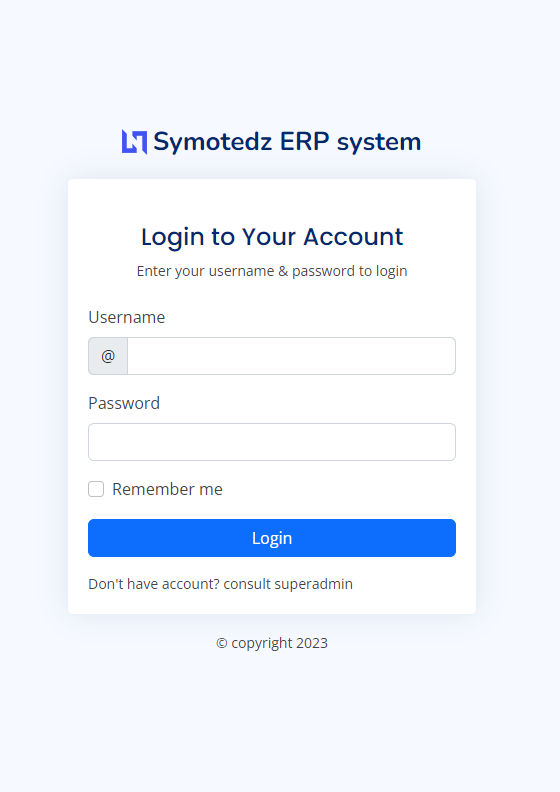

# ERP(Enterprise Resourse Planning System)
 Symotedz Main ERP System
 ________________________________________________________________________________________________________________________________
 Streamlining and intergrating various business processes within an organization.Automation of whole business
 ________________________________________________________________________________________________________________________________

## Instructions
1) Fork The repo

2) Create a New Branch -> git checkout -b feature-branch

3) Set up the Environment -> pip install -r requirements.txt

4) Make your Changes and commit -> git commit -m "Your descriptive commit message"
 
5) Push your Branch to your Folk - > git push origin feature-branch

6) Create a Pull Request

### Ensure to properly comment on the code

 - Licensed under GPL-3.0 https://www.gnu.org/licenses/gpl-3.0.en.html
 - https://github.com/symotedz/erp.git

 
