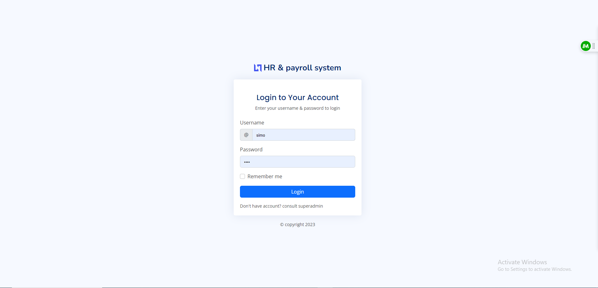
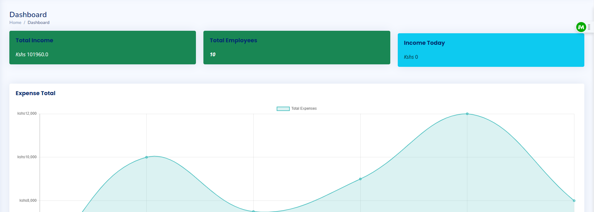
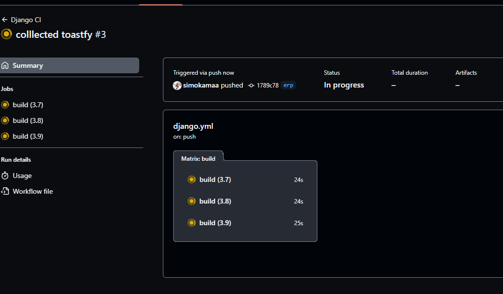

Comprises of:
1) Payroll System
2) Accounting System
3) HR System
4) Payment Gateways Intergration
5) Billing System Intergration

Incoming Future date Feature: Customer Portal

SCM -Supply chain management
CRM - Customer Relation Management System

## CRM
Certainly! Customer Relationship Management (CRM) involves managing interactions and relationships with customers. There are several CRM models that organizations can adopt based on their specific needs and goals. Here are three common CRM models:

1. **Operational CRM Model:**
   - **Focus:** Streamlining Front-End Processes
   - **Description:** Operational CRM is centered around improving and automating customer-facing processes. It includes modules such as sales automation, marketing automation, and service automation. The goal is to enhance customer interactions and optimize the efficiency of sales, marketing, and customer service teams. This model helps in capturing, storing, and analyzing customer data to improve customer satisfaction and loyalty.

2. **Analytical CRM Model:**
   - **Focus:** Data Analysis and Customer Insights
   - **Description:** Analytical CRM focuses on analyzing customer data to derive valuable insights for strategic decision-making. It involves the use of data mining, predictive analytics, and business intelligence tools to understand customer behavior, preferences, and trends. This model enables organizations to make data-driven decisions, personalize marketing strategies, and forecast customer needs, ultimately improving the overall customer experience.

3. **Collaborative CRM Model:**
   - **Focus:** Enhancing Communication and Collaboration
   - **Description:** Collaborative CRM emphasizes improving communication and collaboration across different departments within an organization to better serve the customer. It involves integrating information from various touchpoints to create a unified view of the customer. This model facilitates seamless collaboration between sales, marketing, customer service, and other teams, ensuring a holistic approach to customer interactions. The goal is to provide consistent and personalized experiences at every stage of the customer journey.

These CRM models can be implemented individually or in combination, depending on the organization's goals and requirements. The choice of the CRM model depends on factors such as the nature of the business, customer engagement strategies, and the level of integration needed across various business functions.

## Supply Chain Management System Models
Supply Chain Management (SCM) involves the efficient management of the entire supply chain, from raw material procurement to the delivery of finished products to customers. Various models and frameworks can be used to represent different aspects of Supply Chain Management. Here are three commonly used SCM models:

1. **SCOR Model (Supply Chain Operations Reference Model):**
   - **Focus:** Process Standardization
   - **Description:** SCOR is a widely recognized framework developed by the Supply Chain Council. It defines a set of standardized processes, metrics, and best practices for supply chain management. The model is divided into four levels: process categories, process types, process elements, and detailed practices. SCOR provides a common language for organizations to describe, measure, and evaluate their supply chain processes.

2. **Bullwhip Effect Model:**
   - **Focus:** Demand Variability
   - **Description:** The Bullwhip Effect model focuses on the amplification of demand variability as it moves upstream in the supply chain. It illustrates how small fluctuations in customer demand can lead to larger and more erratic variations in orders placed by retailers, distributors, manufacturers, and suppliers. Understanding and mitigating the Bullwhip Effect is crucial for minimizing excess inventory and maintaining a responsive supply chain.

3. **CPFR Model (Collaborative Planning, Forecasting, and Replenishment):**
   - **Focus:** Collaboration Between Supply Chain Partners
   - **Description:** CPFR is a model that emphasizes collaboration and information sharing among supply chain partners, including suppliers, manufacturers, distributors, and retailers. It involves joint planning and forecasting to enhance the accuracy of demand forecasts and facilitate more efficient replenishment processes. CPFR aims to reduce lead times, inventory levels, and costs through improved communication and coordination across the supply chain.

These models provide a framework for understanding and improving various aspects of supply chain management. Organizations often adopt a combination of these models based on their specific needs, industry requirements, and the nature of their supply chain operations. Additionally, advancements in technologies like blockchain, IoT (Internet of Things), and AI (Artificial Intelligence) are increasingly influencing modern supply chain management models, adding new dimensions such as real-time visibility, traceability, and predictive analytics.
